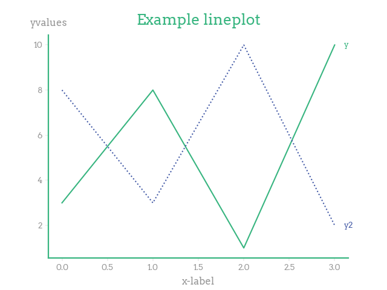
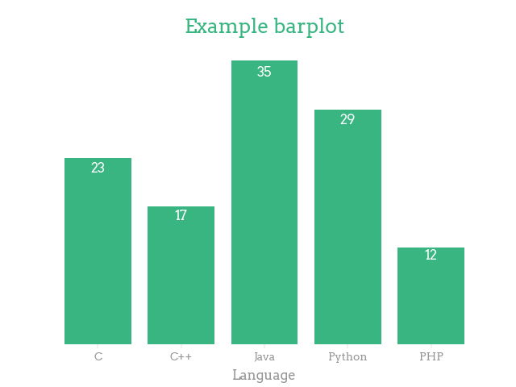

[](https://dataroots.io)
 
[](https://test.pypi.org/project/rootsstyle/)
[](https://www.python.org/downloads/)
[](https://codecov.io/gh/datarootsio/rootsstyle)

<div align="center">

# rootsstyle
</div>

A matplotlib styling package for clean, minimal dataroots themed plots. 
Works with any visualization tools that builds upon Matplotlib (seaborn, pandas).

<div align="center">
    
</div>


## Installation
### using pip
```python
pip install -i https://test.pypi.org/simple/ rootsstyle
```
### using [poetry](https://python-poetry.org/)
```python
# 1. Add repository to pyproject.toml
[[tool.poetry.source]]
name = "testpypi"
url = "https://test.pypi.org/simple/"
# 2. Add package and automatically resolve dependencies
poetry add rootsstyle
```

## Usage
<b>Example</b>
<div style="display: flex;">
<div style="display: flex; flex-direction: column; justify-content: space-between; align-items: center;">
<div>

```python
import rootsstyle
import matplotlib.pyplot as plt

plt.style.use(rootsstyle.style)
y, y2 = [3, 8, 1, 10], [8, 3, 10, 2]
plt.plot(y, label='y')
plt.plot(y2, label='y2', linestyle = 'dotted')
rootsstyle.ylabel('yvalues')
plt.xlabel('x-label')
rootsstyle.legend()
plt.title('Example plot')
plt.show()
```
</div>

<div style="height: 50%;">
    
</div>
</div>

<div style="display: flex; flex-direction: column; justify-content: space-between; align-items: center;">
<div>

```python
import rootsstyle
import matplotlib.pyplot as plt

plt.style.use(rootsstyle.style)
languages = ['C', 'C++', 'Java', 'Python', 'PHP']
students = [23,17,35,29,12]
plt.bar(languages, students)
plt.xlabel('Language')
rootsstyle.show_bar_values()
plt.title('Example barplot')
plt.show()
```
</div>

<div style="height: 50%;">
    
</div>
</div>
</div>
<b>STYLING</b>

```python
import rootsstyle
import matplotlib.pyplot as plt

# globally
plt.style.use(rootsstyle.style)

# within context manager
with plt.style.context(rootsstyle.style):
    # ...
```
<b>FUNCTIONS</b>
* Place the legend to the right of the plot.<br>For lineplots, place the legend entries left of the corresponding line.
    ```python 
    rootsstyle.legend(handles=None, labels=None, title=None)
    ```

* Place the y-label above the y-axis and rotate it, so that it is horizontal.
    ```python 
    rootsstyle.ylabel(ylabel: str)
    ```
* Show barvalues at each bar. <br>Removes the y-axis (optional).<br>Bar values can be shown just 'below' the top of each bar, or just 'above' each bar.
    ```python 
    rootsstyle.show_bar_values(remove_y_axis=True, fontsize=12, position="below", fmt="{:.0f}")
    ```

 

## Color Palette
<div align="center">
    
</div>


## CHANGELOG
see the [CHANGELOG.md](https://github.com/datarootsio/rootsstyle/blob/main/CHANGELOG.md) file

## ROADMAP
### v0.2
- <code>rootsstyle.publish()</code>: allows you to publish an example .png with the corresponding code sample for other users to utilize as an example plot.
